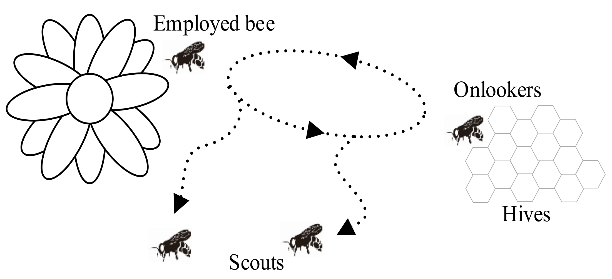
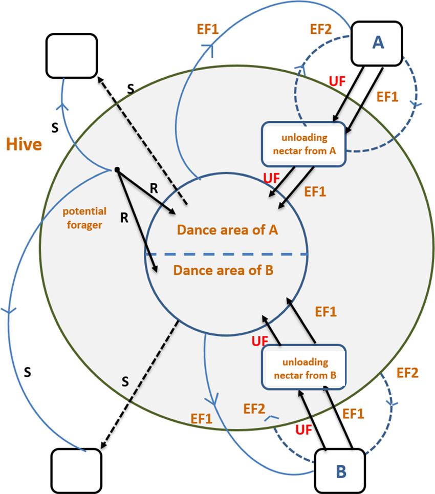
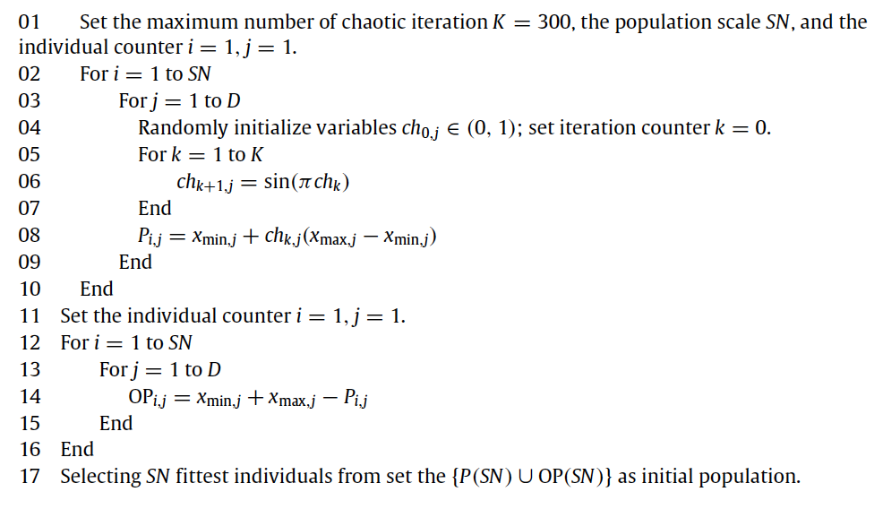

About
=====

Artificial Bee Colony
----------------------

The *Artificial Bee Colony (ABC)* algorithm is a popular optimization technique inspired by the foraging behavior of honeybee swarms. 
It was first introduced by *Karaboga* in 2005 as a simple and efficient population-based algorithm for solving numerical optimization problems. 
The algorithm mimics how honeybees search for food sources, communicate their quality, and collaboratively optimize their collection process.
The *ABC* algorithm is particularly well-suited for solving complex optimization problems, including those with non-linear, multi-modal, or 
high-dimensional search spaces.

Collective Intelligence of Honey Bees
^^^^^^^^^^^^^^^^^^^^^^^^^^^^^^^^^^^^^

The minimal model of swarm-intelligent forage selection in a honey bee colony consists of three kinds of bees:

- **Employed Bees**: bees associated with specific food sources that they are actively exploiting. Employed bees gather information about their respective sources (such as distance, direction, and profitability) and share this knowledge with unemployed bees (onlookers and scouts) within the hive;
- **Onlooker Bees**: bees waiting in the hive and evaluating the information communicated by employed bees. By means of this information, they probabilistically select which food source to explore, favoring those with higher profitability;
- **Scout Bees**:  bees exploring the environment randomly, searching for new food sources when current ones become exhausted or less rewarding. Scouts ensure the colony continues to discover new opportunities for resource collection.

Communication among bees occurs in the *dancing area*, a specific region within the hive where information about food sources is exchanged through a behavior known 
as **waggle dance**. At this stage, employed foragers share their information with a "dance intensity" proportional to the profitability of the food source. Onlooker bees 
observe their dance and use the information to decide which food source to visit. 

..    :alt: Scheme of the foraging mechanism

At the very beginning, a potential forager will start as unemployed forager. That forager bee will have no knowledge about the food sources around the nest. 
There are two possible options for such a bee:

- It can be a scout (S) and starts searching around the nest spontaneously for food due to some internal motivation or possible external clue;
- It can be a recruit (R) after watching the waggle dances and starts searching for a food source.

After finding the food source, the bee utilizes its own capability to memorize the location and then immediately starts
exploiting it. Hence, the bee will become an employed forager. The foraging bee takes a load of nectar from the source
and returns to the hive, unloading the nectar to a food store. After unloading the food, the bee has the following options:

- It might become an uncommitted follower after abandoning the food source (UF);
- It might dance and then recruit nest mates before returning to the same food source (EF1);
- It might continue to forage at the food source without recruiting bees (EF2).

Optimization Framework
^^^^^^^^^^^^^^^^^^^^^^

In our optimization framework, the position of a food source represents a possible solution to the optimization
problem, and the nectar amount of a food source corresponds to the profitability (fitness) of the associated solution.

.. note::
    In the proposed version, each food source is exploited by only one employed bee. In other words, the number of employed bees is equal to the number
    of food sources existing around the hive (number of solutions in the population). 

The *ABC* algorithm can be summarized in the following steps:

1. **Initialization**: a population of candidate solutions (employed bees) is randomly initialized within the search space. 
Each solution is then evaluated based on the objective function, and the best solution is identified as the current global best.

2. **Employed Bee Phase**: In this phase, each employed bee searches for a new candidate solution in the neighborhood of its current position by applying a small perturbation. 
If the candidate solution is better than the current one, the bee adopts the new position; otherwise, it retains the current one (*greedy-selection*).

3. **Onlooker Bee Phase**: Onlooker bees probabilistically choose a solution to explore, based on the fitness information provided by the employed 
bees (better solutions are more likely to be selected). Like employed bees, onlooker bees explore a new candidate solution in the neighborhood 
of the selected solution and evaluate its quality. If the new solution is better (or equal) than the current one, the onlooker bee adopts the new 
position and replaces the employed bee that provided the information.

4. **Scout Bee Phase**: If an employed bee has not improved its solution after a certain number of iterations (*limit*), 
it becomes a scout bee and searches for a new solution.

These phases are repeated iteratively until a termination criterion is met, such as reaching the maximum number of iterations or achieving a satisfactory solution quality.

**Key features:**

* The *exploitation* of good solutions is driven by the employed and onlooker bees, ensuring the algorithm intensifies the search around promising areas.
* The *exploration* of the search space is maintained by the scout bees, preventing premature convergence to local optima.

Mathematical Formulation
------------------------

Consider a minimization problem of the form:

.. .. math::
..     \text{min} f(\mathbf{x})
..     :label: eq-minimization
.. math::
    \begin{aligned}
    &\text{min} \quad f(\mathbf{x}) \\
    &\text{s.t.} \quad x_{\text{min},j} \leq x_j \leq x_{\text{max},j}, \quad j = 1, \dots, D
    \end{aligned}
    :label: eq-minimization-with-bounds

where :math:`f(\mathbf{x})` is the objective function to minimize and :math:`\mathbf{x} = (x_1,...,x_D) \in \mathbb{R}^D` represents a candidate solution in a 
D-dimensional search space. While this is not a constrained optimization problem, we still impose bounds on each dimension of the search space:
:math:`x_{\text{min},j}` and :math:`x_{\text{max},j}` for :math:`j=1,...,D`.

Initialization
^^^^^^^^^^^^^^

In the initialization phase, we generate a population of :math:`SN` candidate solutions :math:`\{\mathbf{x}_i\}_{i=1}^{SN}` (employed bees) as follows:

.. math::
    x_{i,j} = x_{\text{min},j} + \text{rand}(0,1) \cdot (x_{\text{max},j} - x_{\text{min},j}) \quad \text{for} \quad i=1,...,SN \quad \text{and} \quad j=1,...,D
    :label: eq-initialization

where :math:`x_{\text{min},j}` and :math:`x_{\text{max},j}` are the lower and upper bounds of the search space along dimension :math:`j`, respectively.

Employed Bee Phase
^^^^^^^^^^^^^^^^^^
Starting from a solution :math:`\mathbf{x}_{i}`, a new candidate solution :math:`\mathbf{v}_{i}` in its neighborhood is generated by:

.. math::
    v_{i,j} = x_{i,j} + \phi_{i,j} \cdot (x_{i,l} - x_{k,j})
    :label: eq-StandardABC_perturbation

where:

- :math:`\mathbf{x}_{k}` is a randomly selected solution (different from :math:`\mathbf{x}_{i}`);
- :math:`\phi_{i,j}` is a random number in the range :math:`[-1,1]`;
- :math:`j` is a randomly selected dimension index.

.. note::
    - As the difference between the parameters of the :math:`x_{i,j}` and :math:`x_{k,j}` decreases, the perturbation on the j-th position decreases. Thus, as the search approaches to the optimal solution in the search space, the step length is adaptively reduced.
    - If a parameter value produced by this operation exceeds its predetermined boundaries, the parameter can be set to an acceptable value with a clipping operation.

Once :math:`\mathbf{v}_{i}` is generated, its fitness will be evaluated and compared to :math:`\mathbf{x}_i`. For a minimization problem, the fitness of a solution :math:`\mathbf{x}` can be defined as:

.. math::
    \text{fitness}(\mathbf{x})= \begin{cases}
                                    \cfrac{1}{1+f(\mathbf{x})} & \text{if} \quad f(\mathbf{x}) \geq 0 \\[0.2cm]
                                    1+ |f(\mathbf{x})| & \text{otherwise}
                                \end{cases}
    :label: eq-fitness

where :math:`f(\mathbf{x})` is the objective function value at solution :math:`\mathbf{x}`. A greedy selection is then applied between :math:`\mathbf{x}_i` and :math:`\mathbf{v}_i` to retain the better solution.

Onlooker Bee Phase
^^^^^^^^^^^^^^^^^^

At this stage, onlooker bees select a solution to explore based on the fitness information provided by the employed bees. This probabilistic selection can be performed in several ways, such as roulette wheel,
ranked selection, or tournament selection. In the original implementation, roulette wheel selection was adopted. Hence, the probability  :math:`p_i` of selecting a solution :math:`\mathbf{x}_i` is given by:

.. math::
    p_i = \cfrac{\text{fitness}(\mathbf{x}_i)}{\sum_{i=1}^{SN} \text{fitness}(\mathbf{x}_i)}
    :label: eq-roulette_wheel

Once an onlooker bee selects a solution :math:`\mathbf{x}_i`, a new candidate solution :math:`\mathbf{v}_i` is generated and evaluated in the same way as in the employed bee phase (see Equation :eq:`eq-StandardABC_perturbation` 
and Equation :eq:`eq-fitness`). Again, the better solution between :math:`\mathbf{x}_i` and :math:`\mathbf{v}_i` is retained according to a greedy selection strategy.

.. note::
    At the end of the onlooker bee phase, the population of employed bees is updated with the new solutions obtained by the onlooker bees!

Scout Bee Phase
^^^^^^^^^^^^^^^

If a solution :math:`\mathbf{x}_i` has not been improved for a certain number of iterations (*limit*), it becomes a scout bee. In this case, the 
solution is randomly initialized within the search space by using Equation :eq:`eq-initialization`.

.. tip::
    A good heuristic for the *limit* parameter is :math:`0.6 \cdot \text{SN} \cdot \text{D}`, where :math:`\text{SN}` is the
    number of employed bees and :math:`\text{D}` is the dimensionality of the search space.

Termination Critera
^^^^^^^^^^^^^^^^^^^

The algorithm continues to iterate through the employed, onlooker, and scout bee phases until a termination criterion is met. 
In the original *Artificial Bee Colony (ABC)* proposal, the algorithm terminates when a predefined maximum number of iterations is reached. In this package, I included also a stagnation condition that 
monitors the variability of the bees in the colony: if the variability of the fitness falls below a certain threshold, it indicates that the search has stagnated, and the algorithm terminates early, preventing unnecessary computations.

The stagnation value at time :math:`t` is calculated as follows:

.. math::
    \text{S}(t) = \frac{1}{SN} \sum_{i=1}^{SN} {\Big( \text{fitness}(\mathbf{x}_i) - \overline{\text{fitness}(t)} \Big)^2}
    :label: eq-stagnation_criteria
    
where :math:`\overline{\text{fitness}(t)}` is the average fitness of the population :math:`\{ \mathbf{x}_1,...,\mathbf{x}_N \}` at time :math:`t`.

If the stagnation value is below a certain threshold :math: `\tau`, the algorithm halts, ensuring computational efficiency while still achieving good optimization results.

Variants of the *ABC* Algorithm
-------------------------------

Several variants of the *ABC* algorithm have been proposed to enhance its performance and address specific challenges in optimization problems...

Different initialization
^^^^^^^^^^^^^^^^^^^^^^^^

Population initialization is a crucial task in evolutionary algorithms because it can affect the convergence speed and the quality of the final solution.
*Wei-feng Gao* and *San-yang Liu* proposed a novel initialization approach which combines *opposition-based* learning with cahotic systems to generate
the initial population. The package follows the proposal of the authors and implements a sinusoidal iterator, like follows:

.. math::
    ch_{k+1} = \sin(\pi \cdot ch_k) \quad \text{for} \quad k=1,...,K
    :label: eq-cahotic_system

where :math:`k` is the iteration counter and :math:`K` is the maximum number of cahotic iterations (defaults to 300).

Equation :eq:`eq-cahotic_system` is then used to generate the initial population according to the following algorithm:

Different mutations
^^^^^^^^^^^^^^^^^^^^

In basic ABC, a new candidate solution :math:`\mathbf{v}_i`  is obtained changing only one parameter of the parent 
solution :math:`\mathbf{x}_i`, resulting into a slow convergence rate. In order to overcome this issue, a control parameter 
called modification rate (*MR*), was introduced. In this modified version, each parameter  :math:`x_{i,j}` is updated 
according to the following equation:

.. math::
    v_{i,j} = \begin{cases}
                x_{i,j} + \phi_{i,j} \cdot (x_{i,j} - x_{k,j}) & \text{if} \quad \text{rand}(0,1) \leq \text{MR} \\[0.2cm]
                x_{i,j} & \text{otherwise}
              \end{cases}
    :label: eq-ModifiedABC_perturbation

where :math:`\phi_{ij}` is a random number in the range :math:`[-1,1]` and :math:`\mathbf{x}_k` is a donor 
solution different from :math:`\mathbf{x}_i`.

.. note::
    The mutation rate plays a crucial role in balancing the exploration and exploitation in the search for candidate solutions.
    A lower value of MR may cause solutions to improve slowly while a higher one may cause too much 
    diversity in a solution and hence in the population. It is hence recommended to avoid too high values, as they
    may weaken the exploitation capability of the algorithm. Since the optimal value of MR is problem-dependent, it is
    usually decided after a tuning phase.

Another modification is related to the magnitude of the perturbation. In the original *ABC*, the perturbation :math:`(x_{i,j} - x_{k,j})`
is multiplied by a factor :math:`\phi_{i,j} \in [-1,1]`. In the modified version, such factor is allowed to vary in a more general
interval :math:`[-SF, SF]`, where :math:`SF` is called *scaling factor*.

.. note::
    A lower value of SF allows the search to fine tuning the process in small steps while causing slow convergence. 
    A larger value of SF speeds up the search, but it reduces the exploitation capability of the perturbation process.

Moreover, the scaling factor can be adaptively adjusted during the optimization process. Such automatic tuning is performed
by using the *"one-fifth" rule*, which monitors the ratio of succesful mutations. In particular:

.. math::
    \text{SF}(t+1) = \begin{cases}
                \text{SF}(t) \cdot k & \text{if} \quad \phi(m) < \cfrac{1}{5} \\[0.2cm]
                \cfrac{\text{SF}(t)}{k} & \text{if} \quad \phi(m)  > \cfrac{1}{5} \\[0.2cm]
                \text{SF}(t) & \text{otherwise}
              \end{cases}
    :label: eq-ScalingFactor

where :math:`\phi(m)` is the ratio of successful mutations and :math:`k` is typically set to be 0.85 (value proposed by *Karaboga*).

Other mutation strategies inspired by the field of *Differential Evolution* have been proposed in the 
literature (and implemented in this package), such as:

- **ABC/best/1**:
    .. math::
        v_{i,j} = x_{\text{best},j}+ \phi_{i,j} \cdot ( x_{k_1,j} - x_{k_2,j})
- **ABC/best/2**:
    .. math::
        v_{i,j} = x_{\text{best},j}+ \phi_{i,j} \cdot ( x_{k_1,j} - x_{k_2,j}) + \phi_{i,j} \cdot (x_{k_3,j} - x_{k_4,j})

where :math:`x_{\text{best},j}` is the best solution in the population, :math:`\phi_{i,j}` is a random scaling factor and 
:math:`x_{k_1,j}, x_{k_2,j}, x_{k_3,j}, x_{k_4,j}` are randomly selected donor solutions.

A further extension to the mutation strategies is the *Directed Artificial Bee Colony algorithm*, which incorporates 
directional information to improve convergence speed and search efficiency. While in the original *ABC* the perturbation
is applied in a random direction (remember :math:`\phi_{i,j} \in [-1,1]`, or :math:`\phi_{i,j} \in [-SF,SF]` in the more 
general formulation), now direction information for each dimension is added. The new candidate solution is then generated as follows:

.. math::
    v_{i,j} = \begin{cases}
                x_{i,j} + \phi_{i,j} \cdot (x_{i,j} - x_{k,j}) & \text{if} \quad d_{i,j} = 0 \\[0.2cm]
                x_{i,j} + r_{i,j} \cdot |x_{i,j} - x_{k,j}|    & \text{if} \quad d_{i,j} = 1 \\[0.2cm]
                x_{i,j} - r_{i,j} \cdot |x_{i,j} - x_{k,j}|    & \text{if} \quad d_{i,j} = -1
              \end{cases}
    :label: eq-DirectedABC_perturbation

where :math:`\phi_{i,j} \in [-1,1]`and :math:`r_{i,j} \in [0,1]` are two randomly choosen scaling factors, while 
:math:`d_{i,j} \in \{-1,0,1\}` is the direction information for the j-th dimension of the i-th solution. After computing 
the new candidate solution, two scenarios can occur:

1. If :math:`\mathbf{v}_i` is worse (or equal) than :math:`\mathbf{x}_i`, the direction information :math:`d_{i,j}` is set to 0;
2. If :math:`\mathbf{v}_i` is better than :math:`\mathbf{x}_i`, the direction information :math:`d_{i,j}` is updated as follows:
    
    .. math::
        d_{i,j} = \begin{cases}
                    1 & \text{if}  \quad v_{i,j} > x_{i,j} \\[0.2cm]
                    -1 & \text{if} \quad v_{i,j} < x_{i,j} \\[0.2cm]
                  \end{cases}

.. note::
    At initialization, the direction information is set to 0 for all dimensions.
